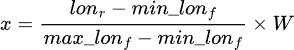
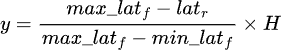
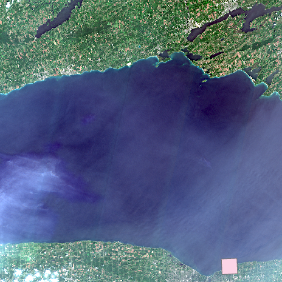
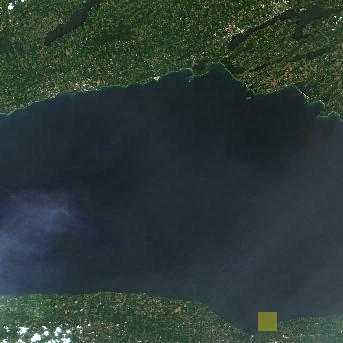
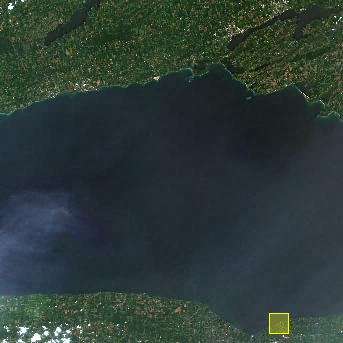
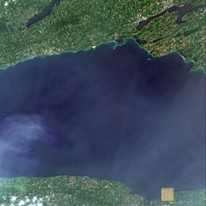

# Mapping-Nearshore-Cladophora-in-Lake-Ontario
**Introduction and Study Area**

Cladophora is a filamentous green alga native to the North American Great Lakes. Its excessive proliferation not only causes foul odors and impairs public beach recreation but also triggers severe ecological issues, including avian botulism outbreaks. Since the 1990s, the filtering effect of invasive species such as dreissenid mussels has significantly increased water clarity, allowing sunlight to penetrate to greater depths. This has led to massive Cladophora blooms even under relatively low nutrient concentrations. The study area of this research focuses on the nearshore waters along the southern shore of Lake Ontario (the United States side). To achieve precise calibration of remote sensing observations, the spatial scope of the study is strictly defined as two independent 6 km × 6 km square regions, centered respectively around two key hydrological and biological monitoring stations established by the United States Geological Survey (USGS): the OIR station (Irondequoit, near Rochester) and the OOL station (Olcott).
These two core USGS stations provide substantial, highly valuable ground-truth data for this study. These comprehensive datasets encompass multi-depth water flow velocities, water turbidity, and various critical chemical constituents in the water column (such as nutrient concentrations). More importantly, the stations provide net weight data of Cladophora samples collected in situ across different depth gradients. These multi-dimensional, high-precision ground truth indicators not only serve as an irreplaceable validation foundation for evaluating and calibrating various spectral remote sensing indices within our open-source computational architecture, but also enable us to deeply investigate the complex mechanisms underlying the relationships between micro-environmental physicochemical variables and nearshore benthic algal outbreaks.

  

  

For each coordinate of the ROI, we can use the formula to calculate the relative position on the quicklook image. The $lon_r$ and $lat_r$ are the longitude and latitude of the point we are calculated. For $maxlon_f$ is east of the quicklook footprint, $min⁡lon_f$ is west of the quicklook footprint $max⁡lat_f$ is north of the quicklook footprint and $min⁡lat_f$ is south of the quicklook footprint. W and H are the width and height of the quicklook image

**ROI find by geoinfomation**

  

**ROI find by calculate quicklook footprint**

  

**ROI find by homography**

  

**compair of homogarphy result and geoinfomation result**

  

