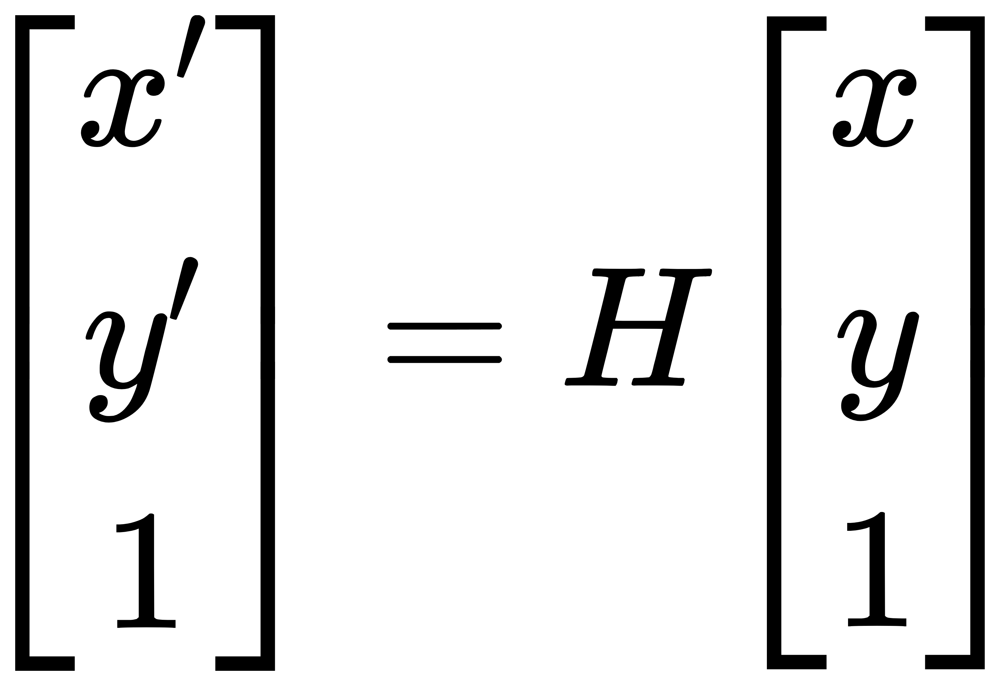
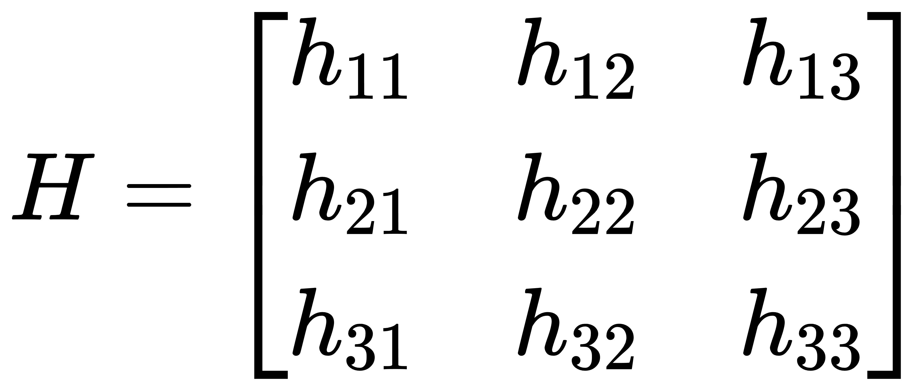
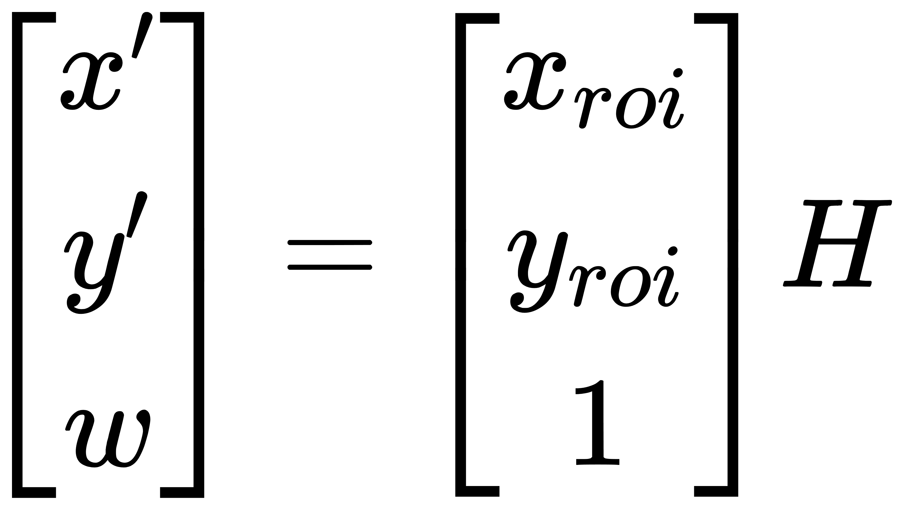
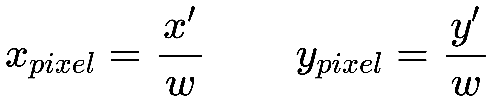
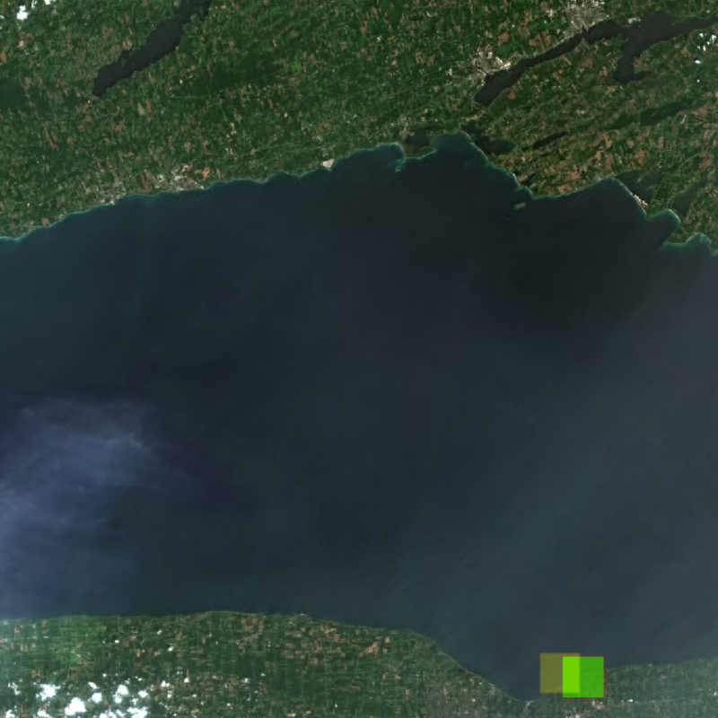
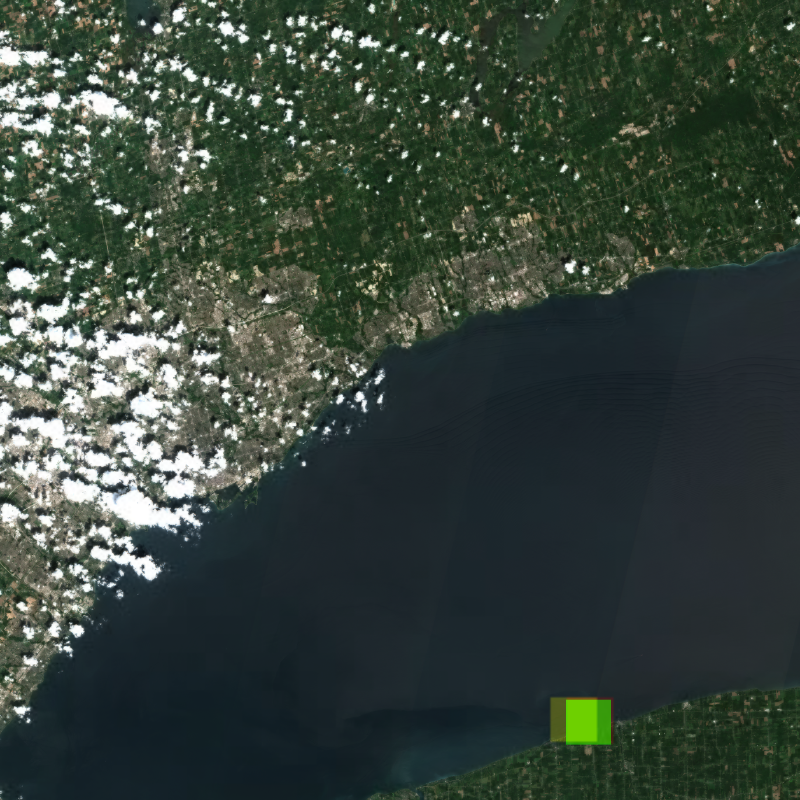

# Mapping-Nearshore-Cladophora-in-Lake-Ontario
**Introduction and Study Area**

Cladophora is a filamentous green alga native to the North American Great Lakes. Its excessive proliferation not only causes foul odors and impairs public beach recreation but also triggers severe ecological issues, including avian botulism outbreaks. Since the 1990s, the filtering effect of invasive species such as dreissenid mussels has significantly increased water clarity, allowing sunlight to penetrate to greater depths. This has led to massive Cladophora blooms even under relatively low nutrient concentrations. The study area of this research focuses on the nearshore waters along the southern shore of Lake Ontario (the United States side). To achieve precise calibration of remote sensing observations, the spatial scope of the study is strictly defined as two independent 6 km × 6 km square regions, centered respectively around two key hydrological and biological monitoring stations established by the United States Geological Survey (USGS): the OIR station (Irondequoit, near Rochester) and the OOL station (Olcott).
These two core USGS stations provide substantial, highly valuable ground-truth data for this study. These comprehensive datasets encompass multi-depth water flow velocities, water turbidity, and various critical chemical constituents in the water column (such as nutrient concentrations). More importantly, the stations provide net weight data of Cladophora samples collected in situ across different depth gradients. These multi-dimensional, high-precision ground truth indicators not only serve as an irreplaceable validation foundation for evaluating and calibrating various spectral remote sensing indices within our open-source computational architecture, but also enable us to deeply investigate the complex mechanisms underlying the relationships between micro-environmental physicochemical variables and nearshore benthic algal outbreaks.

  

  

For each coordinate of the ROI, we can use the formula to calculate the relative position on the quicklook image. The $lon_r$ and $lat_r$ are the longitude and latitude of the point we are calculated. For $maxlon_f$ is east of the quicklook footprint, $min⁡lon_f$ is west of the quicklook footprint $max⁡lat_f$ is north of the quicklook footprint and $min⁡lat_f$ is south of the quicklook footprint. W and H are the width and height of the quicklook image

**ROI find by geoinfomation**

  

**ROI find by calculate quicklook footprint**

  

The footprint polygon and the region of interest (ROI) are first loaded from GeoJSON files and transformed into a consistent coordinate reference system to ensure spatial alignment. The four corner points of the footprint are then ordered consistently (top-left, top-right, bottom-right, bottom-left) to match the corresponding image coordinate system. 
The quicklook image is subsequently loaded, and its pixel coordinate system is defined such that the top-left corner is (0,0), the top-right is (W,0), the bottom-right is (W,H), and the bottom-left is (0,H), where W and H denote the image width and height. 
The homography transformation can be defined as: 

  

where (x,y) represents a point in the geographic coordinate space, and （x',y') denotes the corresponding point in the image coordinate space. The use of homogeneous coordinates allows the transformation to represent not only linear operations (such as scaling, rotation, and translation) but also projective (perspective) distortions. 

To establish a mapping between the geographic coordinate space and the image pixel space, a homography matrix $H\in R^{3\times 3}$  is computed using at least four pairs of corresponding points between the footprint (in geographic coordinates) and the image corners (in pixel coordinates). The homography matrix is defined as: 

  

where each parameter hij encodes a component of the projective transformation. Specifically, h11,h12,h22,h22 represent linear transformations such as scaling, rotation, and shear; h13and h23 correspond to translation in the horizontal and vertical directions; and h31 and 32 introduce perspective distortion, enabling the mapping between non-rectangular geographic footprints and the image plane. The parameter h33 acts as a normalization factor. 

After the homography matrix is calculate base on the footprint coordinate and corresponding image coordinate, the ROI corresponding image coordinate can be calculate base on the homography matrix.
The transformation from geographic coordinates to image coordinates is performed in homogeneous form: 

  

where $x_{roi}$ and $y_{roi}$ denotes a point in geographic coordinates which is the coordinate of the roi, and x'and y' represents the corresponding homogeneous coordinates in the image space and w is the scaling factor in the homogeneous coordinates . The final pixel coordinates are obtained by normalization: 

  

The calculatation process can be simplify by using python openCV library. The ROI vertices are transformed using the homography matrix and maps the ROI from geographic space to image pixel space. Because of the result is homogeneous coordinates, it need normalized by the scale factor that obtain from the final pixel coordinates. The projected ROI points are used to compute a bounding box in pixel coordinates, ensuring the values are clipped within image boundaries. Finally, the corresponding image region is cropped and calculate the region cloud density base on image brightness.

**ROI find by homography**

  

Green is the ground truth provide by the geoinformation. Yellow is the result using the rectangle projection. Red is the result using homography

**compair ori**

  

**compair ool**

  

| Dataset| Method     | Coverage | Precision| IoU      |
|--------|------------|----------|----------|----------|
| ori    | rectangle  | 0.375946 | 0.366582 | 0.227901 |
|        | Homography | 0.998136 | 0.836551 | 0.835246 |
| ool    | rectangle  | 0.649688 | 0.633553 | 0.472232 |
|        | Homography | 0.967785 | 0.896563 | 0.870581 |

Coverage: how much of the ground truth ROI is successfully captured by the method.  
Precision: how much of the predicted region actually belongs to the ground truth ROI indicating overestimation.  
IoU : evaluation of both under-coverage and over-coverage 
